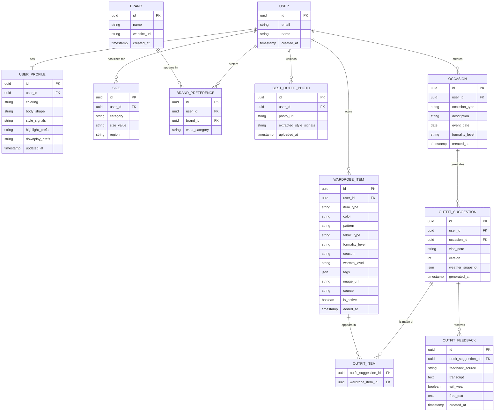

# Personal Stylist — ER Diagram

*Scope: onboarding + occasion-based outfit recommendations (current location, live weather)*
*Draft v2*

---

## Entity notes

| Entity | Purpose |
|---|---|
| `USER` | Core account only. Location read live from phone at recommendation time — nothing stored. |
| `USER_PROFILE` | Style signals extracted from best-outfit photos — coloring, body shape, highlight/downplay prefs. |
| `SIZE` | One row per wear category (tops, bottoms, dresses, shoes) per user. Region-aware for international sizing. |
| `BRAND` | Brands as their own entity — reusable across users. |
| `BRAND_PREFERENCE` | Junction: USER ↔ BRAND with wear_category (day-to-day, office, occasion, athletic, activewear). Multiple brands per category supported. |
| `BEST_OUTFIT_PHOTO` | Photos uploaded during onboarding. AI extracts style signals stored in USER_PROFILE. |
| `WARDROBE_ITEM` | Structured columns for stylist-critical attributes (formality_level, season, pattern, fabric_type, warmth_level) + flexible JSON tags. warmth_level (light / medium / warm / heavy) is the AI's primary signal for weather-based filtering. |
| `OCCASION` | What the user is dressing for — occasion_type, description, when (event_date), formality_level. No location stored. |
| `OUTFIT_SUGGESTION` | Outfit built from owned wardrobe items for the occasion. Versioned — each change request creates a new record. weather_snapshot (JSON: temp, conditions) stores the live weather at generation time so feedback is contextually meaningful. |
| `OUTFIT_ITEM` | Junction: which wardrobe items make up a given outfit suggestion. |
| `OUTFIT_FEEDBACK` | feedback_source (audio \| text), transcript only — audio transcribed in real-time, never stored. will_wear is the strongest positive signal and feeds future recommendations. |
