# Personal Stylist — ER Diagram

*Scope: onboarding + occasion-based style recommendations (when, where, what for)*
*Draft v1*

```mermaid
erDiagram

    USER {
        uuid id PK
        string email
        string name
        string geography
        string currency
        decimal budget_min
        decimal budget_max
        timestamp created_at
    }

    USER_PROFILE {
        uuid id PK
        uuid user_id FK
        string coloring
        string body_shape
        string style_signals
        string highlight_prefs
        string downplay_prefs
        timestamp updated_at
    }

    SIZE {
        uuid id PK
        uuid user_id FK
        string category
        string size_value
        string region
    }

    BRAND_PREFERENCE {
        uuid id PK
        uuid user_id FK
        string wear_category
        string brand_name
    }

    BEST_OUTFIT_PHOTO {
        uuid id PK
        uuid user_id FK
        string photo_url
        string extracted_style_signals
        timestamp uploaded_at
    }

    WARDROBE_ITEM {
        uuid id PK
        uuid user_id FK
        string item_type
        string color
        string attributes
        string image_url
        string source
        boolean is_active
        timestamp added_at
    }

    OCCASION {
        uuid id PK
        uuid user_id FK
        string occasion_type
        string description
        date event_date
        string location
        string formality_level
        timestamp created_at
    }

    STYLE_RECOMMENDATION {
        uuid id PK
        uuid user_id FK
        uuid occasion_id FK
        text gap_description
        text what_you_own_note
        timestamp created_at
    }

    RECOMMENDED_PRODUCT {
        uuid id PK
        uuid recommendation_id FK
        string product_name
        string retailer
        decimal price
        string price_tier
        string product_url
        string affiliate_url
        string image_url
    }

    OUTFIT_SUGGESTION {
        uuid id PK
        uuid user_id FK
        uuid occasion_id FK
        string vibe_note
        timestamp generated_at
    }

    OUTFIT_ITEM {
        uuid outfit_suggestion_id FK
        uuid wardrobe_item_id FK
    }

    OWNED_COVERAGE {
        uuid recommendation_id FK
        uuid wardrobe_item_id FK
        string coverage_note
    }

    USER ||--|| USER_PROFILE : "has"
    USER ||--o{ SIZE : "has sizes for"
    USER ||--o{ BRAND_PREFERENCE : "prefers brands by"
    USER ||--o{ BEST_OUTFIT_PHOTO : "uploads"
    USER ||--o{ WARDROBE_ITEM : "owns"
    USER ||--o{ OCCASION : "creates"
    OCCASION ||--o{ STYLE_RECOMMENDATION : "triggers"
    OCCASION ||--o{ OUTFIT_SUGGESTION : "has"
    STYLE_RECOMMENDATION ||--o{ RECOMMENDED_PRODUCT : "includes"
    STYLE_RECOMMENDATION ||--o{ OWNED_COVERAGE : "references owned"
    WARDROBE_ITEM ||--o{ OWNED_COVERAGE : "already covers"
    OUTFIT_SUGGESTION ||--o{ OUTFIT_ITEM : "is made of"
    WARDROBE_ITEM ||--o{ OUTFIT_ITEM : "appears in"
```



---

## Entity notes

| Entity | Purpose |
|---|---|
| `USER` | Core account + geography + budget |
| `USER_PROFILE` | Style signals extracted from best-outfit photos — coloring, body shape, highlight/downplay prefs |
| `SIZE` | One row per wear category (tops, bottoms, dresses, shoes) per user |
| `BRAND_PREFERENCE` | One row per wear category (day-to-day, office, occasion, athletic, activewear) per user |
| `BEST_OUTFIT_PHOTO` | Photos uploaded during onboarding; AI extracts style signals into USER_PROFILE |
| `WARDROBE_ITEM` | Every clothing item the user owns; tagged with type, color, attributes |
| `OCCASION` | A specific event or goal — what, when, where, and how formal |
| `STYLE_RECOMMENDATION` | The stylist's response to an occasion — the gap + what they already own |
| `RECOMMENDED_PRODUCT` | Up to 3 specific buyable products attached to a recommendation, across price tiers |
| `OUTFIT_SUGGESTION` | A complete outfit built from owned wardrobe items for the occasion |
| `OUTFIT_ITEM` | Junction: which wardrobe items make up a given outfit suggestion |
| `OWNED_COVERAGE` | Junction: which owned items already cover a gap (the honesty guardrail in data form) |
```
